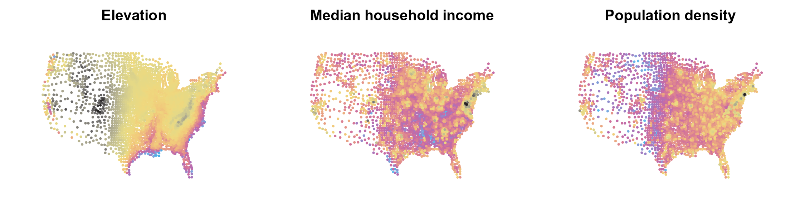
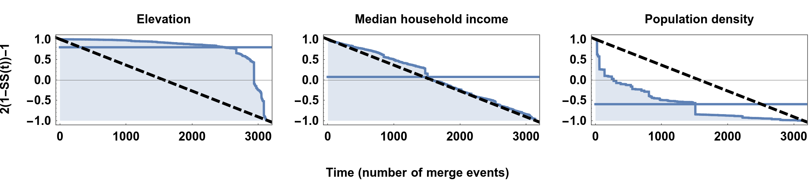

# Fast Spatial Autocorrelation

**Contact**

Anar Amgalan (anar.amgalan@stonybrook.edu) and Steven S. Skiena (skiena@cs.stonybrook.edu)

An example of a variable/feature values with spatial coordinates:

This repository contains the simple algorithm for fast computation of spatial autocorrelation. 
The statistic and the algorithm are introduced in ICDM 2020 (archive link or DOI identifier). 

## Dependencies

* python3 
* numpy 
* scipy 

## Datasets

The datasets used in the paper are mainly from:

Can Twitter be used to predict county excessive alcohol consumption rates?
Curtis B, Giorgi S, Buffone AEK, Ungar LH, Ashford RD, et al. (2018) Can Twitter be used to predict county excessive alcohol consumption rates?. PLOS ONE 13(4): e0194290. https://doi.org/10.1371/journal.pone.0194290

The dataset used in the example of time-series features with preserved coordinates is from:

Lilianne R. Mujica-Parodi, Anar Amgalan, Syed Fahad Sultan, Botond Antal, Xiaofei Sun, Steven Skiena, Andrew Lithen, Noor Adra, Eva-Maria Ratai, Corey Weistuch, Sindhuja Tirumalai Govindarajan, Helmut H. Strey, Ken A. Dill, Steven M. Stufflebeam, Richard L. Veech, Kieran Clarke
Proceedings of the National Academy of Sciences Mar 2020, 117 (11) 6170-6177; DOI: 10.1073/pnas.1913042117 
